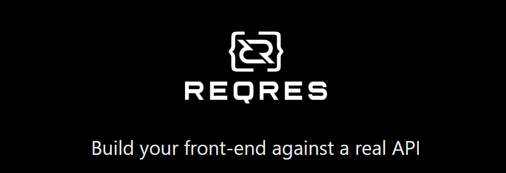
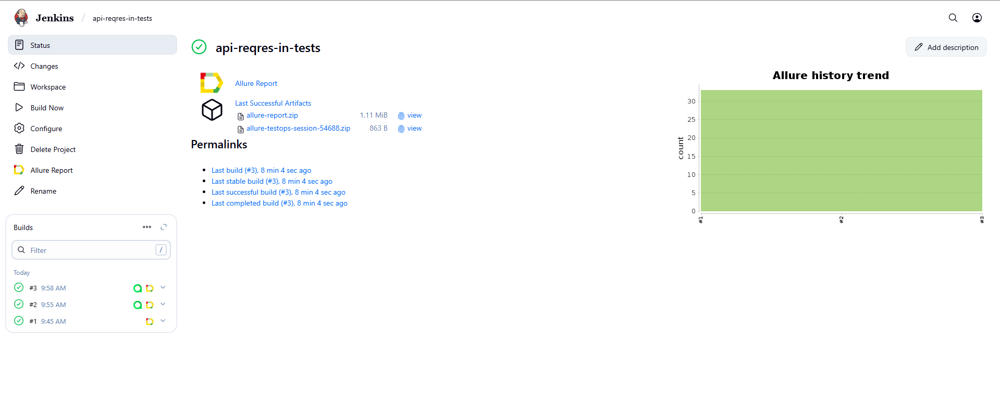
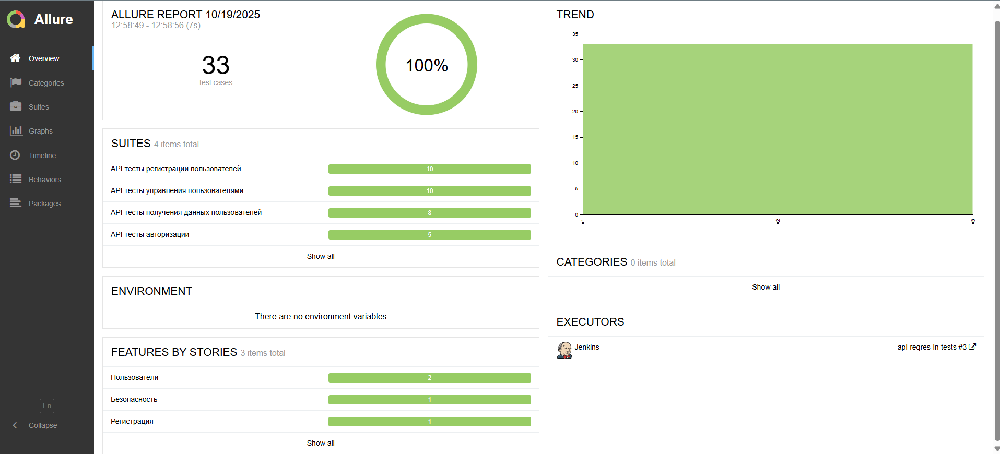
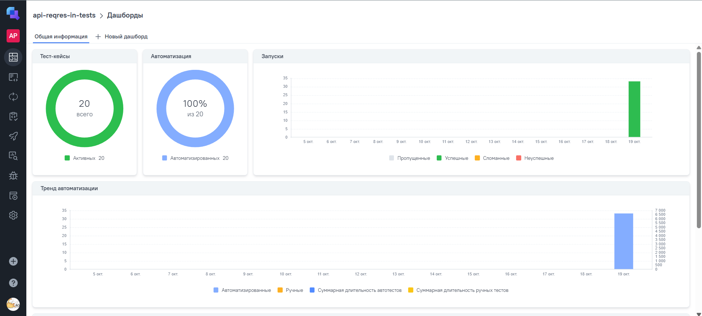
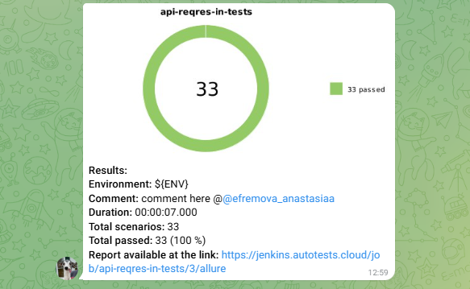

# 🚀 API Automation Framework для Reqres.in



> Проект автоматизированного тестирования REST API Reqres.in.

## 📋 О проекте

Проект представляет собой комплексный фреймворк для автоматизированного тестирования [Reqres.in API](https://reqres.in) - публичного REST API для тестирования, включающий:

- **REST API тестирование** всех доступных эндпоинтов
- **Положительные и отрицательные сценарии** тестирования
- **Параметризованные тесты** с различными наборами данных
- **Интеграционное тестирование** бизнес-сценариев
- **Продвинутую отчетность** с Allure Framework

---

## 📚 Содержание

- [Технологии и инструменты](#технологии-и-инструменты)
- [Архитектура тестов](#архитектура-тестов)
- [Тест-кейсы](#тест-кейсы)
- [Запуск тестов](#запуск-тестов)
- [Сборка в Jenkins](#-сборка-в-jenkins)
- [Allure отчет](#-allure-отчет)
- [Интеграция с TestOps](#-интеграция-с-testops)
- [Интеграция с Jira](#-интеграция-с-jira)
- [Телеграмм-бот с уведомлениями о результатах тестов](#-телеграмм-бот-с-уведомлениями-о-результатах-тестов)
- [Пример записи видео при выполнении тестов в Selenoid](#-пример-записи-видео-при-выполнении-тестов-в-selenoid)

---

<a id="технологии-и-инструменты"></a>
## 🛠 Технологии и инструменты

<p align="center">  
<a href="https://www.jetbrains.com/idea/"></a>  
<a href="https://www.java.com/"></a>  
<a href="https://github.com/"></a>  
<a href="https://junit.org/junit5/"></a>  
<a href="https://gradle.org/"></a>
<a href="https://qameta.io/"></a>   
<a href="https://www.jenkins.io/"></a>  
<a href="https://www.atlassian.com/ru/software/jira/"></a>  
</p>

---

<a id="архитектура-тестов"></a>
## 🏗 Архитектура тестов

```bash
src/test/java/
├── api/                           # API клиенты
│   ├── AuthApiClient.java         # Клиент для аутентификации
│   ├── RegisterApiClient.java     # Клиент для регистрации
│   └── UsersApiClient.java        # Клиент для управления пользователями
├── config/                        # Конфигурация
│   ├── ReqresConfig.java          # Интерфейс конфигурации
│   └── ReqresConfigProvider.java  # Провайдер конфигурации
├── helpers/                       # Вспомогательные классы
│   └── CustomAllureListener.java  # Кастомные Allure листенеры
├── models/                        # Модели данных
│   ├── login/                     # Модели для логина
│   ├── register/                  # Модели для регистрации
│   ├── createUser/                # Модели создания пользователя
│   ├── updateUser/                # Модели обновления пользователя
│   └── getUsers/                  # Модели получения пользователей
├── services/                      # Бизнес-сервисы
│   ├── AuthService.java           # Сервис аутентификации
│   ├── RegisterService.java       # Сервис регистрации
│   └── UserService.java           # Сервис управления пользователями
├── specs/                         # Спецификации API
│   └── ApiSpecs.java              # Базовые спецификации
├── tests/                         # Тестовые классы
│   ├── AuthTests.java             # Тесты аутентификации
│   ├── RegisterTests.java         # Тесты регистрации
│   ├── UserReadTests.java         # Тесты чтения пользователей
│   └── UserWriteTests.java        # Тесты записи пользователей
└── utils/                         # Утилиты
    └── TestDataGenerator.java     # Генератор тестовых данных
````


---

<a id="тест-кейсы"></a>
## ✅ Тест-кейсы

🔐 Тесты аутентификации

✅ Успешная авторизация с валидными учетными данными

✅ Параметризованная авторизация различных пользователей

✅ Авторизация с неверными учетными данными

✅ Авторизация с некорректным форматом email

📝 Тесты регистрации

✅ Успешная регистрация предопределенного пользователя

✅ Регистрация сгенерированного пользователя (негативный сценарий)

✅ Регистрация без обязательного пароля

✅ Регистрация без обязательного email

✅ Параметризованная проверка с валидными но неопределенными пользователями

👥 Тесты чтения пользователей

✅ Получение пагинированного списка пользователей

✅ Параметризованное получение пользователей по ID

✅ Получение первой страницы пользователей

✅ Валидация структуры ответа пользователя

✏️ Тесты управления пользователями

✅ Создание пользователя со случайными реалистичными данными

✅ Параметризованное создание пользователей с различными должностями

✅ Полное обновление данных пользователя

✅ Частичное обновление имени пользователя

✅ Удаление пользователя с последующей проверкой

✅ Комплексный workflow создания и обновления

---

<a id="запуск-тестов"></a>
## 🚀 Запуск тестов

### Локальный запуск всех тестов
```bash
./gradlew clean test
```
### Локальный запуск тестов с определенными тегами
```bash
./gradlew clean test -Dgroups="auth"
./gradlew clean test -Dgroups="regression"
./gradlew clean test -Dgroups="smoke"
```

##  Сборка в Jenkins
[Сборка в Jenkins](https://jenkins.autotests.cloud/job/ui-mts-job-tests/2/)
<p align="center">
    
</p>

##  Allure-отчет
[Allure отчет](https://jenkins.autotests.cloud/job/ui-mts-job-tests/2/allure/)
<p align="center">
    
</p>

##  Интеграция с TestOps
[Интеграция с TestOps](https://allure.autotests.cloud/project/4958/dashboards)
<p align="center">
    
</p>

##  Интеграция с Jira
[Интеграция с Jira](https://jira.autotests.cloud/browse/HOMEWORK-1516)
<p align="center">
    
</p>

##  Телеграмм-бот с уведомлениями о результатах тестов
<p align="center">

</p>

